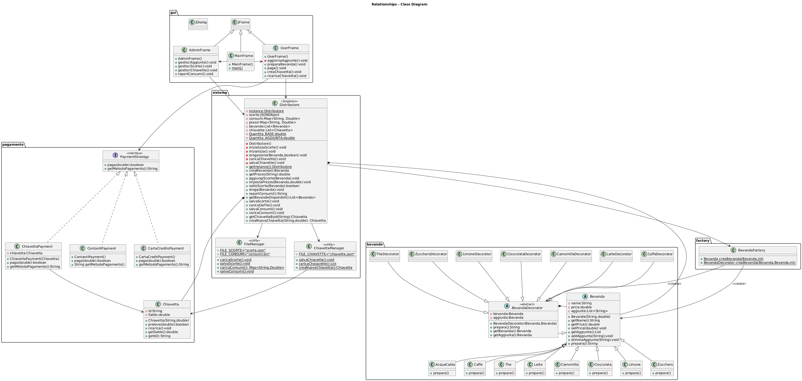

# Distributore Bevande (Beverage Vending Machine)

A beverage vending machine simulator written in **Java (Swing)**, with a **user** mode and an **administrator** mode.
Exam project for the Programming III course (academic year 2024/2025), built to put five design patterns into practice in a concrete use case.



## Features

**User**
- Choose a drink (coffee, tea, milk, chamomile, hot chocolate, hot water), an optional addition (e.g. coffee + milk, tea + lemon) and the number of sugar doses
- Pay with cash (coins of 5, 10, 20, 50 cents, 1 and 2 euros), a rechargeable key card or a credit card (simulated)
- Create and top up a key card (amounts of 5, 10, 20 and 50 euros)

**Administrator**
- Restock drinks, with an automatic alert when a drink drops below 1 liter
- Set the price of each drink
- Monthly consumption report by drink type
- Create new drinks by combining existing ones
- Manage key cards

## Design patterns

| Pattern | Where | Purpose |
|---|---|---|
| **Decorator** | `bevande/BevandaDecorator` and subclasses | Adds ingredients (milk, lemon, sugar...) to a drink at runtime, combining name, price and preparation |
| **Factory** | `factory/BevandaFactory` | Builds the decorated drink chosen by the user, hiding the instantiation logic from the client |
| **Strategy** | `pagamento/PaymentStrategy` and implementations | Selects the payment method at runtime (cash, key card, credit card) |
| **Singleton** | `sistema/Distributore` | A single vending machine instance shared by all windows |
| **Facade** | `sistema/Distributore` | A simple interface to persistence, stock and key card management |

The full description, with code excerpts, is in [Relazione.md](Relazione.md) (in Italian). The code is documented with Javadoc (in Italian), already generated in [`doc/`](doc/index.html).

## Requirements

- Java 8 or later
- A desktop environment (the interface is built with Swing)

## Quick start

From the **repository root folder** (data files are read from the current directory):

```bash
java -jar DistributoreBevande.jar
```

## Building from source

The only dependency is [org.json](https://github.com/stleary/JSON-java), already included in `lib/`.

Linux / macOS:
```bash
mkdir -p bin
javac -cp lib/json-20250107.jar -d bin $(find src -name "*.java")
java -cp "bin:lib/json-20250107.jar" gui.MainFrame
```

Windows (PowerShell):
```powershell
mkdir bin -Force
javac -cp lib/json-20250107.jar -d bin (Get-ChildItem -Recurse src -Filter *.java).FullName
java -cp "bin;lib/json-20250107.jar" gui.MainFrame
```

The project can also be imported into Eclipse as an existing Java project (`.project` and `.classpath` are included).

## Repository structure

```
src/
  bevande/    drinks and decorators (Decorator)
  factory/    BevandaFactory (Factory)
  pagamento/  payment methods and key card (Strategy)
  sistema/    Distributore (Singleton/Facade) and file handling
  gui/        Swing windows
lib/          org.json library
diagrammi/    UML diagrams (images and PlantUML source)
doc/          generated Javadoc
scorte.json, chiavette.json, consumi.bin   initial data
```

## Data and persistence

Stock and prices (`scorte.json`), key cards (`chiavette.json`) and monthly consumption (`consumi.bin`) are saved in the current directory and are **updated every time the app is used**. The files included in the repository are the initial state; to restore it, just run

```bash
git checkout -- scorte.json chiavette.json consumi.bin
```

## Notes

- The administrator mode password is `admin123`. It is hardcoded because the exam assignment requires it: do not reuse this approach in a real application.
- Credit card payment is only a simulation: the entered data is neither stored nor sent anywhere.

## Author

Francesco Barbato